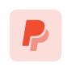

# MoreSFSymbols

A collection of additional custom SFSymbols for Swift

## Content

- [Usage](#usage)
- [Symbols](#symbols)
  - [Logos](#logos)
  - [Commerce](#commerce)
  - [Developer](#developer)
- [Contributing](#contributing)
- [Licence](#licence)

## Usage

**iOS 15.0:**

1. Download the `.svg`-file of the symbol you want.
2. Drag the file into your `Assets.xcassets`.
3. The symbol is ready to use (ex.: `Image("symbol.name")`).

**iOS 14.0 & earlier:**

1. Download the `.svg`-file of the symbol you want.
2. Drag it into the *Custom Symbols* category (found in the sidebar).
3. Select it and click `File > Export Symbol` (or: `cmd+shift+E`)
4. Export it as a `2.0`-version
5. Drag the exported file into your `Assets.xcassets`.
6. The symbol is ready to use (ex.: `Image("symbol.name")`).

> It is important to note that you do not use the SFSymbols initialiser (eg. `systemName:`), but rather the initialiser for images from your assets.

## Symbols

Preview images are rendered in *hierarchical mode* with a color of `.blue`. This however does not mean that there aren't other representation styles for the symbol. Monochrome, palette and multicolour also exist.

Example using the `logo.paypal.square.fill`-icon:

| Monochrome                                                   | Hierarchical                                                 | Palette                                                      | Multicolor                                                   |
| ------------------------------------------------------------ | ------------------------------------------------------------ | ------------------------------------------------------------ | ------------------------------------------------------------ |
|  |  |  |  |
| `.symbolRenderingMode(.monochrome)` & `.foregroundColor(.black)` | `.symbolRenderingMode(.hierarchical)` & `.foregroundColor(.red)` | `.symbolRenderingMode(.palette)` & `.foregroundStyle(.red, .green, .yellow)` (i know it looks bad) | `.symbolRenderingMode(.multicolor)` & `.foregroundColor(.black)` |

### Logos

**Apple**

| Preview                                                      | Name                        |
| ------------------------------------------------------------ | --------------------------- |
|  | `logo.appstore`             |
|  | `logo.appstore.square`      |
|  | `logo.appstore.square.fill` |
|  | `logo.appstore.circle`      |
|  | `logo.appstore.circle.fill` |

**Bluetooth**

| Preview                                                      | Name                                   |
| ------------------------------------------------------------ | -------------------------------------- |
|  | `logo.bluetooth`                       |
|  | `logo.bluetooth.capsule.portrait.fill` |

**Buy me a coffee**

| Preview                                                      | Name                |
| ------------------------------------------------------------ | ------------------- |
|  | `logo.buymeacoffee` |

**GitHub**

| Preview                                                      | Name          |
| ------------------------------------------------------------ | ------------- |
|  | `logo.github` |

**Markdown**

| Preview                                                      | Name                           |
| ------------------------------------------------------------ | ------------------------------ |
|  | `logo.markdown`                |
|  | `logo.markdown.rectangle`      |
|  | `logo.markdown.rectangle.fill` |

**PayPal**

| Preview                                                      | Name                      |
| ------------------------------------------------------------ | ------------------------- |
|  | `logo.paypal`             |
|  | `logo.paypal.alternative` |
|  | `logo.paypal.circle`      |
|  | `logo.paypal.circle.fill` |
|  | `logo.paypal.square`      |
|  | `logo.paypal.square.fill` |

### Commerce

**Piggy Bank**

> coming soon

**Tip Jar**

> coming soon

### Developer

**Git**

> coming soon

## Contributing

Are you missing an icon or wish for a specific variant? Create an issue with the `new icon`-tag, or better yet: contribute to this project by submitting a pull request. I'm always happy to welcome new contributors who want to help me expand this collection even further. To get started, read the [CONTRIBUTION.md](https://github.com/cameronshemilt/MoreSFSymbols/blob/main/CONTRIBUTING.md).

## Licence

Icons in the `logos`-category may be protected as a trademark in some jurisdictions. If you want to use it, you have to ensure that you have the legal right to do so and that you do not infringe any trademark rights.

You may use all other Icons for personal and commercial use.
